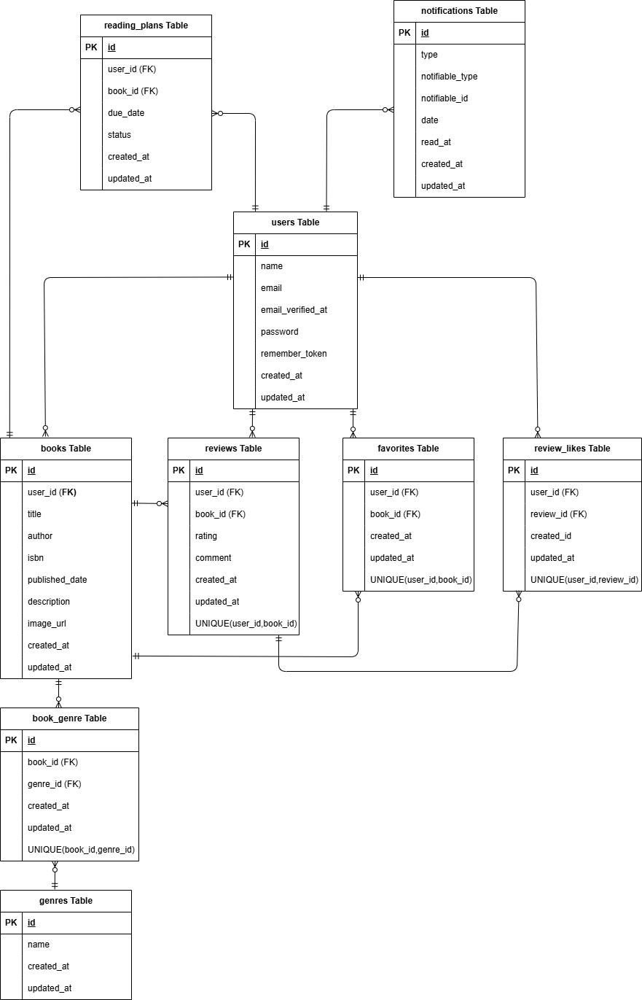

# BookShelf 書籍レビューアプリ

## 概要

ユーザーは書籍を登録・閲覧し、レビューの投稿やお気に入り登録ができます。
ジャンルによる分類やレビューへのいいね機能、平均評価に基づくランキング機能も備えています。
外部アプリケーション向けの公開API(JSON)も提供します。

## ER図

## 環境構築手順

## 使用技術

## APIエンドポイント

## 環境開発URL

http://localhost

## 作成者

宮古澄佳
